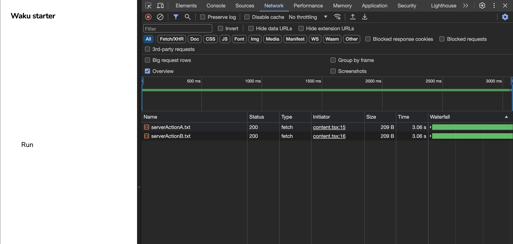
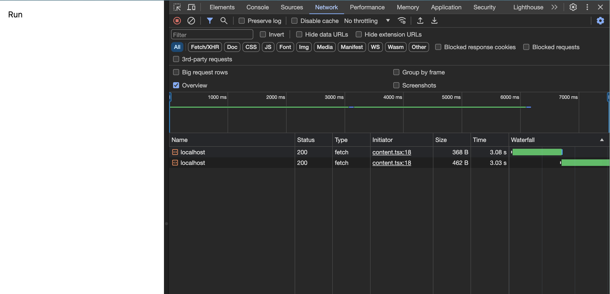

It shows you how Waku's server actions work.

Original tweet: https://twitter.com/AdamRackis/status/1765771998993490031

Original Repo: https://github.com/arackaf/next-server-actions-test

# Waku server actions test
- Waku

- Next.js

* https://github.com/arackaf/next-server-actions-test/tree/dacda97621031e520fe4700c7c9cb0c48fbad9e9
